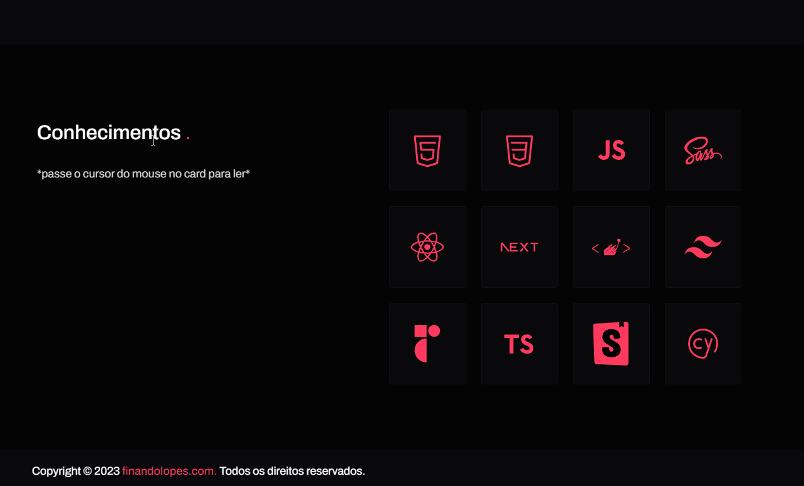

<h1 align="center">
  💻 Portfólio - Fernando Lopes 
</h1>

- [Link do projeto:](https://finandolopes.github.io/-Publicando-Portifolio-Profissional-Github-Pages/)

## 📚 Seções

O site é composto por cinco seções:

- **Home:** Nele temos uma breve apresentação;
- **Quem sou:** Nessa seção tenho uma descrição dizendo um pouco sobre quem sou;
- **Experiências:** Abordo algumas empresas da qual prestei meus serviços na área de desenvolvimento e design;
- **Projetos:** Apresenta alguns projetos desenvolvidos e com link direto para os respectivos códigos no GitHub;
- **Serviços:** Exibe através de cards os diferentes serviços em que possuo conhecimentos;
- **Conhecimentos:** Nele apresentamos meus conhecimentos em algumas linguagens como o foco no front-end;

---

## 💼 Tecnologias utilizadas

Para o desenvolvimento deste site utilizei as seguintes tecnologias:

- HTML;
- Sass;
- JavaScript;
- ScrollReveal;
- SVG Inject;

## 🖥 Preview:

  

